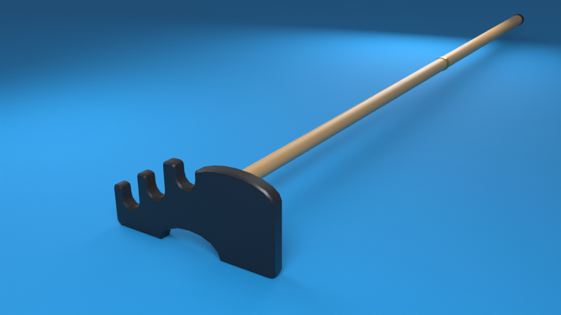

# Bridge (rake): BridgeModel



This is the snooker-style **bridge** (also called a rake) that appears when the cue ball is too far
away for the avatar to reach. It has three parts:

- A near-black **stepped "moose head"** plate with three U-shaped notches: **High**, **Mid** and
  **Low**.
- A 6-stud **maple shaft**.
- **Brass** fittings (a collar that holds the plate, plus a thin joint ring), and a black
  **rubber cap** on the butt.

**Why this shape?** The game's cue is nearly flat (4 degrees of elevation), so both lower
notches sit on the shooter's right. When the game places the bridge, it swings the shaft off to
the shooter's left, toward the hand holding it (`ShooterStance` picks the hand's spot and
`BridgeBuilder.place` aims the shaft through it). That makes a V when seen from above, so the
shaft never runs under a cue lying in a notch. When the hand is further away than the shaft
reaches, the game adds an extension past the butt, the same as the cue's.

Everything is generated by `Bridge.py` (Blender 5.2, run headless). Nothing was modelled by
hand.

## Files

| File | What it is |
|---|---|
| `Bridge.py` | The generator. Every number is in the commented `PARAMETERS` dict at the top. |
| `Bridge.blend` | The Blender file it saves: the four meshes, preview materials, the preview camera and lights, and a copy of `Bridge.py` in the Text Editor. |
| `BridgeModel.fbx` | What you import into Roblox Studio: four meshes named `Head`, `Shaft`, `Ferrule` and `Cap`. |
| `Parameters.json` | Every parameter, plus the Roblox-local numbers the game uses (see below), triangle counts and check results. |
| `renders/preview.png` | The picture above (960 x 540). |

## Rebuilding it

1. Change a number in `PARAMETERS` at the top of `Bridge.py` if you need to. Every number has
   a comment saying what it does.
2. In Terminal, from the repository folder (`8ball`), run:
   ```bash
   /Applications/Blender.app/Contents/MacOS/Blender -b --factory-startup --python-exit-code 1 --python assets/bridge/Bridge.py
   ```
3. It takes about 5 seconds and rewrites `Bridge.blend`, `BridgeModel.fbx`, `Parameters.json`
   and `renders/preview.png`. The last lines it prints start with `BRIDGE`, and a good run ends
   with `BRIDGE OK`. If any check fails, it stops with an error and exit code 1 (the checks
   are listed under "What the script checks").

You can also run it from inside Blender: open `Bridge.blend`, go to the **Scripting** tab,
choose `Bridge.py` in the Text Editor, then click **Run Script** (the play button).

**If you change a number that the game also knows** (pivot height, notch positions, head width,
shaft axis height or shaft length), change `Config.Bridge` in `src/shared/Config.luau` to match.
`tests/bridge_test.luau` compares `Config.Bridge` with `Parameters.json` and fails if they
disagree. After a rebuild the FBX also has to be imported again (next section).

## Importing into Roblox Studio

1. **Open the importer.** In Studio's **Home** tab, click **Import 3D** and pick
   `assets/bridge/BridgeModel.fbx`.
2. **Set the scale.** In the preview window, open **File Geometry** and set **Scale Unit** to
   **Stud**. Leave the scale at **1**.
3. **Other options.**
   - If you see **Merge Meshes**, turn it **off**. The game needs the four separate parts.
   - If you see **Import Materials/Textures**, turn it **off**. The game colours the parts
     itself.
   - Upload to the same owner (group) as the game.
4. **Import.** Click **Import**. In the Explorer, check that the model contains `Head`,
   `Shaft`, `Ferrule` and `Cap`. Rename the model to **BridgeModel** if it has a different
   name.
5. **Store it.** Drag **BridgeModel** into **ServerStorage**.
6. **Don't fix the rotation by hand.** When Studio imports any FBX from this project, it turns
   it half a turn (the same turn `TableBuilder.prepareImport` undoes) and moves the pivot. The
   game straightens the bridge itself: `BridgeBuilder.normalize` reads which way the `Shaft`
   points and where the `Head` is. Don't rotate or re-pivot it.
7. **Test.** Press **Play**. The Output window must **not** show
   `[8ball] no ServerStorage.BridgeModel: the bridge uses the parts fallback`.
8. **Save.** Save to `place/8ball.rbxl` and publish. This is part of the milestone's single
   save, not a separate one.

## Pivot and axes

- **Pivot:** the cue's centre line when the cue lies in the **High** notch. That is 0.36 studs
  above the cloth, because the plate's base sits on the cloth. All four meshes have their
  origin at this point, with no rotation or scale.
- **Roblox local** (after `BridgeBuilder` straightens the import):
  - **+X** is the shooter's right, looking at the ball.
  - **+Y** is up.
  - **+Z** runs from the head down the shaft, toward the shooter.
- **Blender:**
  - The shaft runs along **+Y** and **Z** is up.
  - **Blender -X** is the shooter's right.
  - **Blender (x, y, z) = Roblox local (-x, z, y).**
- **FBX:** exported with -Z forward and Y up, so the file itself stores (x, z, -y). Studio then
  adds its half turn, which gives (-x, z, y). It also puts each MeshPart at the centre of that
  part's bounding box. That is why the game rebuilds the pivot from `HeadCentre` (below).

## The notches

Each notch is a U: radius 0.055, 0.11 deep, with a rounded 0.02 flare at the mouth. The cue's
centre line rests 0.045 above the notch bottom (the cue's radius). Every notch has a 0.11 outer
(right) wall and a taller inner (left) wall, because each lobe between two notches is as tall as
the higher notch's shoulder. That staircase is the "stepped" part of the moose head.

| Notch | X (right of the pivot) | Y (from the pivot) | Height above the cloth | Notch bottom Y | Roughly used for |
|---|---:|---:|---:|---:|---|
| High | 0 | 0 | 0.36 | -0.045 | follow (top spin) |
| Mid | 0.19 | -0.10 | 0.26 | -0.145 | centre ball |
| Low | 0.365 | -0.20 | 0.16 | -0.245 | draw (back spin) |

The spin column assumes the head sits at the default 1.5 studs behind the ball. The game makes
the real choice (`ShooterStance`, using `Config.Bridge.Notches`).

## Dimensions (studs, Roblox local)

| Mesh | Roblox material, colour | Size and position |
|---|---|---|
| `Head` | SmoothPlastic, (28, 28, 32) | x -0.48 to 0.48 (0.96 wide, about 6 in); y -0.36 (base, on the cloth) to 0.095 (top of the crowned left lobe); 0.07 thick, centred on z = 0; 0.008 bevel on both faces; an arch 0.36 wide and 0.10 tall in the base, centred |
| `Ferrule` | Metal, brass (190, 156, 84) | collar: diameter 0.14, z 0.035 to 0.255, 0.015 chamfers; joint ring: diameter 0.124 (shaft + 0.012), 0.05 long, centred at z 3.40 (55% along the shaft), 0.004 chamfers |
| `Shaft` | Wood, maple (200, 158, 104) | z 0.10 to 6.10 (6.0 long); diameter tapers from 0.09 at the head to 0.13 at the butt |
| `Cap` | Rubber, (22, 22, 24) | diameter 0.14, z 6.08 to 6.20, with a 0.05 domed end |

- The collar, shaft and cap share one axis: x = 0, y = -0.16.
- The whole bridge runs from z -0.035 to z 6.20 (6.235 long).
- The shaft starts inside the collar, and the cap overlaps the shaft end by 0.02, so no gaps
  show.
- The head's bounding-box centre is **(0, -0.1325, 0)**.

## Triangles

| Mesh | Triangles |
|---|---:|
| Head | 516 |
| Shaft | 128 |
| Ferrule | 256 |
| Cap | 128 |
| **Total** | **1,028** (budget 1,500) |

Every round piece has 16 sides.

## Parameters.json

`roblox_local` holds the numbers the game reads, under the same names as `Config.Bridge`:

- `PivotHeightStuds`
- `Notches`: an array in the order Low, Mid, High, each entry `{Name, X, Y}`
- `HeadCentre`
- `HeadWidthStuds`
- `ShaftAxisYStuds`
- `ShaftLengthStuds`
- `Meshes`: `{Material, Color}` for each part

The other sections are:

- `derived`: notch heights above the cloth, notch bottoms and shoulders, head size, and the
  measured bounds of every mesh.
- `triangle_counts`
- `validation`
- `parameters`: a copy of `PARAMETERS`

## What the script checks

The run fails (exit code 1) unless all of these hold:

- Every edge of every mesh has exactly two faces (watertight), and no face has zero area.
- Every face is a triangle, with no loose vertices.
- Each mesh has a positive signed volume, which means its normals point outward.
- The total is 1,500 triangles or fewer.
- The head, shaft, collar and cap bounds match the parameters to 1e-6, and each notch's bottom
  point is a real vertex.
- `BridgeModel.fbx` is imported back into a scratch scene, and every bounding box matches to
  1e-5. The last run's largest difference was 4.6e-7.

Smoothing follows the table's rule: edges where the faces meet at 40 degrees or more are sharp.
The UVs are written directly:

- Round pieces: u goes once around, v is the distance along the shaft in studs.
- Head faces: a flat projection.
- Head sides: distance around the outline by thickness.

The FBX carries simple preview materials (`Bridge_Head` and so on) only so that it looks right
in Blender. Don't import them; the game dresses each part from `Config.Bridge.Meshes`.
