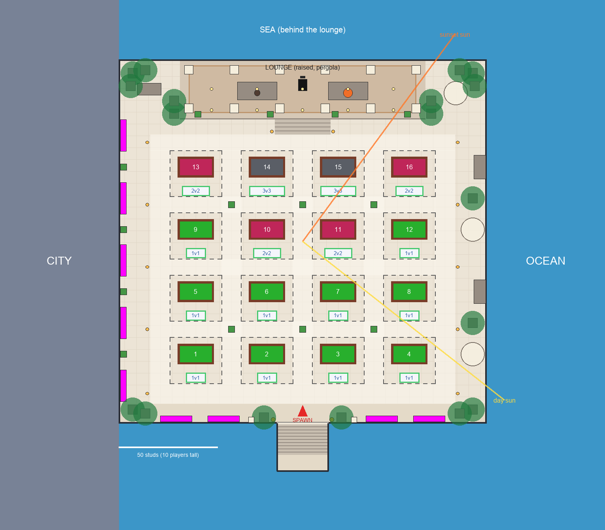

# Rooftop map: spec

The measured facts every stage builds to. The brief is `docs/prompts/ROOFTOP_MAP_PROMPT.md`;
the art is `assets/map/reference/`.

- **Positions** come from `map_layout.py` (written to `Layout.json`, drawn as `Plan.png`).
- **Colours** come from `measure_palette.py` (written to `Palette.json`).

Change those scripts, never the numbers here by hand, then update this file.

## 0. Designer decisions (2026-09-26, Stage 0 interview)

- **Side seating follows 02.**
  - City side: planters, palms and lanterns only.
  - Ocean side: umbrella sets with loungers, plus sofa groups along the railing.
- **The entrance stair** walks down to a small dead-end landing, closed off by the railing and
  an invisible wall.
- **Table looks follow the table's mode**, with wood frames (the regular lobby): green 1v1,
  raspberry 2v2 (`RedWood`), charcoal 3v3 (`CharcoalWood`). This replaces the brief's "all
  green". Ten 1v1 tables sit at the front, four 2v2 and two 3v3 toward the back, as on the
  baseplate.
- **Queue pads sit in front of each table:** centred on the long side that faces the
  entrance. They are rectangles (the other session's change, 8f66025), sized by mode. The
  grid is computed from the pad size in Config, so it re-spaces itself if that changes.
- **Prop scale is split.**
  - Spacing and zones follow the table's scale (the art's layout).
  - Anything a player sits on, climbs or leans on is at player scale.
  - Big decor (planters, palms, umbrellas, the pergola) is about 1.4x player scale, so it
    holds its own beside the 18-stud tables.
- **No snack counter for now** (designer, Checkpoint A): the **grand piano** is the
  centrepiece at the back of the lounge, centred, its bench behind it so the player at the
  keys faces the tables.
- **The railing reaches a character's head:** 5 studs above the floor (Checkpoint A).
- **The city faces the spawn** (Checkpoint A): the view the player gets on arrival (ahead
  and to the left) is where the city is densest and most detailed; behind the spawn, the
  stair side, it thins out and stays low.
- Banners and the pink light pillar (the day panel's pergola ends, 02) are out, with the
  infinity-pool strip.

## 1. Scale and axes

- **Studs, Roblox world axes:**
  - X points right as seen from the entrance: the city is -X, the ocean +X.
  - Y points up; the rooftop floor is Y = 0.
  - Z points toward the entrance; the lounge is -Z.
  - Yaw is degrees about +Y (`CFrame.Angles(0, yaw, 0)`).
- **Two scale bars that disagree** (census, `checkpoints/census.md`):
  - The art draws a real-proportioned 9 ft table. Ours is 18.24 x 10.24 studs over the
    rails, but its cloth is only 2.9 studs up. So in plan it is 2.25x a real table, and in
    height only 1.3x.
  - A player is 5 studs, so 1.75 m = 5 studs: **1 m = 2.86 studs** (the P bar).
  - The table bar (T): 1 table length = 18.24 studs.
- **Which bar sizes what** (designer's split):
  - Layout, spacing and zone depths use T.
  - Seats, steps, railings and lanterns use P.
  - Planters, palms, umbrellas and the pergola use about 1.4 x P.

## 2. Palette

Every colour here comes from `Palette.json`, which `measure_palette.py` measures from the art:
k-means in CIELAB, and for small painted leaves and flowers the "vivid" rule (the most
saturated 15% of pixels). The art paints warm light onto every lit face and cool lavender into
every shadow. So:

- a material's colour (the albedo) is its **daylight** reading where the art has one (02, the
  day panel), not a lamp-lit one;
- the painter's cool shade (`floor_shade` #5D719E, `planter_shade` #797496) is the tint the
  baked ambient occlusion darkens toward, so props read like the art without Roblox GI;
- the sunset readings are targets for the lit result under the Sunset lighting (Stage 7), not
  albedos.

`map_common.py` holds this table; nothing else names a colour.

### Rooftop

| Material | Hex | Source region | Note |
|---|---|---|---|
| Floor tile | #F1CDBD | `floor_panel_day` | light warm tile; 02's #F1BFB8 is pinked by the table glow |
| Grout | the floor 8 L* darker | (rule) | the art's grout lines are 1-2 px, too thin to measure; low contrast by the brief |
| Cream stone: steps, parapet, planter boxes | #DECFD0 | `step` | shade #A08885 |
| Cream columns and beams (pergola, entrance) | #DEBAA8 | `column` | shade #A68E95 |
| Pergola slats (wood) | #725233 | `pergola_slat` | 03 and key-assets |
| Railing frame | #0D0D12 | `railing_frame` | near black |
| Railing glass | #66B4D2 | `railing_glass` | a faint cyan tint at high transparency |
| LED strip, lit trims | #FEE2B2 | `led_strip` | |
| Under-table glow | #EF9054 | `under_table_glow` | shade #C06D4A |
| AO and shadow tint | #5D719E | `floor_shade` | |

### Props

| Material | Hex | Source region | Note |
|---|---|---|---|
| Couch fabric (warm grey) | #F3D8C3 | `couch_day` | shade #AE8480 |
| Cushion blue | #184F73 | `cushion_blue` | |
| Cushion light (the brief's "teal") | #999E9C | `cushion_teal` | the art's light cushion is blue-grey |
| Cushion orange | #EC8C31 | `cushion_orange` | |
| Cushion white | #E2D1D0 | `cushion_white` | 02 ocean sofas |
| Coffee table top | #985D46 | `coffee_table` | apron and legs #372625 |
| Fire pit stone | #5D3E37 | `firepit_stone` | cap #E5AD96 |
| Fire pit glass ring | #5A93AE | `firepit_ring` | |
| Flame | #F6AA3F | `fire` | shade #A65015 |
| Lantern frame | #47322B | `lantern_frame` | |
| Lantern glass, day | #FDF5AB | `lantern_glass` | sunset #FAF4CF |
| Globe light | #FAE091 | `globe_light` | |
| Umbrella canvas | #FCF7E6 | `umbrella_canvas_day` | |
| Umbrella pole | #704433 | `umbrella_pole` | |
| Lounger | #4E4442 | `lounger` | |
| Grand piano | #0E0C0D | `piano_black` | |
| Leaves, lit / mid / deep | #91961E / #6A7409 / #2B4405 | `leaf_lit`, `leaf_mid`, `leaf_dark` | the foliage atlas's three stops |
| Palm fronds, lit / mid | #828913 / #6A770C | `palm_lit`, `palm_mid` | |
| Palm trunk | #6C4B44 | `palm_trunk` | shade #362019 |
| Bougainvillea | #BD1976 | `flower_vivid` | |

The art's greens are a warm yellow-green (Lab hue about 100 to 110). If the critic reads them
as muddy under Roblox's white sun, the fix is to turn the hue toward 120 at the same lightness
and chroma. That is a Checkpoint B adjustment, recorded here if it is made.

### Backdrop, day

| Material | Hex | Source region |
|---|---|---|
| Sky, top / horizon | #3894FC / #86C4FB | `sky_top_day`, `sky_horizon_day` |
| Cloud, lit / underside | #E4E8FC / #BAD1FC | `cloud_day` |
| Water, shallows / deep | #34A8CA / #3187DE | `water_near`, `water_far` |
| Sand | #F5DEC1 | `sand` |
| Island green, near / far | #61866F / #477F8C | `island_green`, `island_far` |
| Island rock | #827790 | `island_rock` |
| Far mountains | #3E93ED | `mountain_far` |
| City glass / facade / far city | #1D5EBB / #C2B2AA / #4875C7 | `city_glass_day`, `city_facade_day`, `city_far_day` |

The backdrop is hazier and less saturated than the rooftop (brief section 4). Atmosphere does
most of that; the far colours above already carry the painter's haze.

### Sunset (targets for the lit result)

| Region | Hex |
|---|---|
| Sky, top / mid / horizon | #7B60BB / #D96094 / #FD7E62 |
| Cloud | #F56077 (shade #CD4D8B) |
| Sun | #FCF480 |
| Sea, in the sun's path / elsewhere | #E87177 / #74519F |
| City glass / lit windows | #3E4C93 / #D5B59C |
| Island silhouettes | #564175 |
| Rooftop floor under sunset light | #EAA1A5 |
| Lantern glass | #FAF4CF |

## 3. The plan

`Plan.png` beside the art's top-down panel: `checkpoints/plan-vs-art.jpg`.

### Table field

| Item | Value |
|---|---|
| Tables | 16 at yaw 0, long sides to the entrance. Ids 1 to 4 are the front row, left to right; 13 to 16 are the back row |
| Modes (front row to back) | 1v1 x4; 1v1 x4; 1v1, 2v2, 2v2, 1v1; 2v2, 3v3, 3v3, 2v2 |
| Looks | 1v1 Green, 2v2 RedWood, 3v3 CharcoalWood |
| Queue pads | rectangles centred in front of each table (+Z): 10, 14 or 18 long by mode, 5 deep (`Queue.PadSizeStuds`) |
| Match fence | 26 across (X); 23.5 deep, from 8.5 behind the table centre to 15 in front, for every mode |
| Pitch | 36 across, 31.5 deep |
| Table centres | X = -54, -18, 18, 54; Z = 47.25, 15.75, -15.75, -47.25 |
| Field (fence outline) | X -67 to 67, Z -55.75 to 62.25 (134 x 118) |
| Aisles between fences | 10 between columns, 8 between rows |

The art spaces its rows about 22 to 24 studs apart. Ours are 31.5 apart, because each match
area holds the shooter's walkway on both long sides plus the pad in front. The columns match
the art: 36 against the art's 34.

### The terrace

| Zone | X | Z | Y |
|---|---|---|---|
| Terrace (railing inner face) | -93 to 93 (186) | -101.75 to 82.25 (184) | 0 |
| Front walkway | -77 to 77 | 62.25 to 72.25 | 0 |
| Entrance landing (the spawn mat at X 0, Z 76.75, facing -Z) | full width | 72.25 to 82.25 | 0 |
| Entrance stair: 10 steps, 0.5 up, 1.6 deep | -13 to 13 | 82.25 to 98.25 | 0 down to -5 |
| Lower landing (dead end) | -13 to 13 | 98.25 to 106.25 | -5 |
| Side walkways | 67 to 77 each side | -55.75 to 62.25 | 0 |
| City side zone / ocean side zone | -93 to -77 / 77 to 93 | -101.75 to 72.25 | 0 |
| Back walkway | -77 to 77 | -63.75 to -55.75 | 0 |
| Lounge central flight: 4 steps, 0.5 up, 2 deep | -14 to 14 | -71.75 to -63.75 | 0 up to 2 |
| Lounge platform (the rest of its front edge is a 2-stud riser) | -62 to 62 | -101.75 to -71.75 | 2 |
| Pergola: 3 bays of 38.3, 22 clear under a 6.5-deep fascia (a tall pavilion, as in the art) | -57.5 to 57.5 | -98.75 to -74.75 | 2 |

- **The edge all round** is a low parapet (1.2 high, 1.2 thick) with a dark-framed glass
  railing to 5 above the floor (a character's head height), and an invisible wall above it to 40.
- **The back corners** beside the platform (X 62 to 93) stay at floor level.
- **The spawn is the art's entrance mat:** the SpawnLocation is a 16 x 0.2 x 6 dark slab lying
  on the floor between the tall lanterns.

### Walkways

- **Width:** every walkway is at least 8 studs.
  - The front walkway and the side walkways are 10.
  - The back walkway is 8.
  - The aisles between columns are 10, and between rows 8 to 11.
- **Nothing solid** stands in any walkway, the lounge flight or the entrance stair, except
  the crossing planters.
- **A crossing planter** keeps at least 8 studs of open floor to anything solid (table barriers
  and props). A match fence is open floor for everyone who is not playing that match.
- `map_layout.py` checks all of this and exits 1 on any problem.

### Props

Positions are in `Layout.json`. Counts follow the art (census): 6 crossing planters as in the
top-down, and one big item per table row along each railing.

| Prop | Count | Where |
|---|---:|---|
| Fern planter | 14 | 6 at the aisle crossings (none in the middle row gap), scaled 1.3 to the art's chunkier boxes; 4 on the city railing, one per row; 4 on the lounge edge, between the pergola's front columns |
| Fern trough (a long low planter) | 11 | 5 along the city railing between the big planters, so the edge reads as one green line (the top-down art); 4 along the front parapet; 2 on the back railing behind the U sectionals (the lounge-back art) |
| Palm planter | 18 | in clusters, not an even ring, at mixed heights (20 to 32): a pair beside the stair; a pair in each front corner; three in each back corner; a pair at each end of the pergola, just off the platform; 2 on the ocean railing. Each stands 7 in from the railing so its crown stays over the roof |
| Lantern | 12 | 5 per side at the row gaps and the front and back walkways, standing just in front of the planted edge (5 in from the railing); 2 flanking the lounge flight |
| Tall lantern | 2 | flanking the stair head |
| Umbrella set (canopy and two loungers) | 3 | ocean side at rows 1 and 3; the ocean back corner |
| Sofa group (sofa, ottoman) | 3 | ocean side at rows 2 and 4; the city back corner |
| U sectional | 2 | under the pergola in the bays either side of the piano (X -38.3 and 38.3): city side round a coffee table, ocean side round the fire pit |
| Coffee table | 1 | inside the city U |
| Fire pit | 1 | inside the ocean U |
| Grand piano and bench | 1 | centred at the back of the pergola, the bench behind it (designer, Checkpoint A) |
| Globe light | 6 | one per bay on the pergola's front and middle beams |
| Cream column | 2 + 8 | 2 framing the entrance; 8 pergola columns (two rows of four) |
| Under-table glow | 16 | a flat plane under each table |

## 4. Prop sizes

Width x depth x height in studs. "P" is player scale (1 m = 2.86 studs); decor is about 1.4 x P.

| Prop | Size | Detail |
|---|---|---|
| Fern planter | 3.2 x 3.2 x 7 | box 3.0 high (P 2.1 x 1.4); ferns to 7 |
| Palm planter | 4.8 x 4.8 box, 3.2 high | palm 20 to 32 tall (per palm, so clusters step), trunk 1.7 thick at the foot, 22 fronds, crown about 18 across |
| Lantern | 1.5 x 1.5 x 4.0 | P 1.0 m lantern x 1.4 |
| Tall lantern | 2.2 x 2.2 x 6.5 | |
| Umbrella set | 12 canopy, rim at 9, top at 12 | two loungers 5.6 x 2.0, seat 1.0, back to 2.6 (P) |
| Sofa group | 12 x 6 footprint | sofa 11 x 3, seat 1.3, back 2.6 (P); ottoman 2.9 square, 1.1 high |
| U sectional | 20 x 9 x 2.6 | seat 1.3, back 2.3 to 2.6 (P); cushions on the back |
| Coffee table | 2.8 round x 1.3 | P |
| Fire pit | 4.5 round x 1.4 | flame about 1.4 above the rim |
| Grand piano | 4.4 x 5.8 x 3.0 | P (2.0 x 1.5 m, 1.0 m tall); bench 2.4 x 1.0 x 1.4 |
| Globe light | 2.25 round (the template scaled 1.5) | its centre 5.6 under the fascia's underside |
| Pergola | 115 x 24, 22 clear | 4.5-square plain cream columns, 4 per row; a 6.5-deep fascia with a shaded underside; wood slats every 2; vine clumps at the column heads; bougainvillea on the right end column |
| Fern trough | 16 x 3, 3.2 high (as tall as the other planters) | ferns above to about 6.5 |
| Entrance column | 2.8 square x 16 | cream |
| Railing | 5.0 high overall (a character's head) | parapet 1.2; posts about every 4 |
| Steps | riser 0.5 | tread 1.6 (entrance), 2.0 (lounge) |

Every seat is a `Seat` part (GDD section 10): sofas, U sectionals, loungers and the piano
bench.

## 5. Camera poses

One pose per reference view, for the captures in every stage's verification. The capture is
cropped to the reference's aspect. They were tuned against the art in Stage 1;
`map_layout.cameras` holds them relative to the terrace's edges:

| View | Reference | Position | Looks at | FOV |
|---|---|---|---|---:|
| entrance | `panels/entrance.jpg` | (0, 7, 68.5) | (0, 4, -60) | 70 |
| day-view | `02-day-view.jpg` | (24, 20, 70.25) | (-8, 0, -45) | 55 |
| high three-quarter (day, sunset) | `panels/day.jpg`, `panels/sunset.jpg` | (0, 46, 130.5) | (0, 0, -8) | 50 |
| top-down | `panels/top-down.jpg` | (0, 400, -9.75), straight down, -Z up | | 30 |
| lounge-back | `panels/lounge-back.jpg` | (38.3, 7.5, -72) | (38.3, 3, -141.75) | 70 |
| city-side | `panels/city-side.jpg` | (-90, 30, 0) | (-600, -20, 0) | 25 |
| ocean-side | `panels/ocean-side.jpg` | (90, 30, -20) | (700, -80, -250) | 25 |
| phone eye | (none; 750 x 361) | (0, 5.6, 76.75) | (0, 4, 0) | 70 |

Captures are taken in Play mode, where the server has built the tables and pads.
`Workspace.StreamingEnabled` is on, so the Near and Backdrop models are
`ModelStreamingMode.Persistent` (MapBuilder), or the far world never reaches the client. A Client
`execute_luau` holds the camera with a RenderStepped connection (`_G.MapPose`) and the
character waits on the lower landing.

## 6. The sun

**The problem:**

- Roblox's sun rises toward +X and sets toward -X, whatever the latitude. This was measured
  in Studio on 2026-09-26 with `Lighting:GetSunDirection()`.
- Our ocean is +X, so an evening sun would set over the city.
- The only real sun low over the ocean is a dawn one.

**The plan:**

- The Sunset state uses a dawn `ClockTime`, and the latitude swings the sun round to the art's
  spot.
- The sun is never faked or painted.

| State | GeographicLatitude | ClockTime | Sun direction | Azimuth (0 = toward the lounge, 90 = toward the ocean) | Elevation |
|---|---:|---:|---|---:|---:|
| Day | 45 | 10.0 | (0.465, 0.806, 0.367) | 128 (right, toward the entrance side) | 54 |
| Sunset | -30 | 6.4 | (0.591, 0.062, -0.804) | 36 (right and ahead, over the sea) | 3.6 |

- **From the entrance, looking at the lounge,** the sunset sun sits 36 degrees right of
  straight ahead and just above the horizon. That is the same spot as in `panels/sunset.jpg`:
  0.8 of the way across the frame, just over the island.
- **The Day sun** is high and front-right, so the side the player sees is lit.
- **The cycle blends both numbers,** so during a fade the sun slides down (or up) the right
  side of the sky, never across it.
- **`Sky.SkyboxOrientation`** turns the painted sunset glow to sit behind the sun (Stage 7).
- **The sea is behind the lounge (-Z) and to the right (+X),** so the sun always sets over
  water.

## 7. The world round the rooftop

- **The tower:**
  - Its footprint is the terrace, plus the stair bay.
  - Its walls drop about 300 studs to the street (about 30 floors). Street level is Y = -300
    and sea level Y = -302.
  - `FallenPartsDestroyHeight` goes below the street (the place has -500).
- **The coast** makes an L round the tower:
  - Land (the city) is to the left and front-left, and carries on behind the tower beyond
    X -350 to the horizon, so the city fills the left of every view as in the art.
  - Water is to the right (X > 110) and behind the tower (Z < -150, X -350 to 110).
  - The beach promenade, sand and palms run along the tower's ocean side and round behind it.
  - Beyond the beach come turquoise shallows, then deep blue sea.
- **Near (Stage 4, within about 400 studs):** the tower's walls, neighbour roofs below ours,
  streets, the promenade, the beach, sailboats.
- **Mid (Stage 5, 400 to 2000 studs):**
  - The skyline: rooftops below ours within about 1500 studs, and a few slim towers taller
    than ours (60 to 180 above the roof) 700 to 1200 out on the city side, so the skyline
    shows over the railing at eye height as in the art.
  - The islands: steep green cones with beaches and rocks. The gray-box puts two big peaks far
    out (about 5000, 850 to 950 tall), one straight behind the pergola and one beside the
    sunset sun, and smaller islands in two clusters. The art's ocean panel also has islands
    near and mid-distance, which Stage 5 adds.
- **The sea in the gray-box:** Terrain water out to 6500 studs, then flat slabs to 8000.
  Distant water reflects the pale sky at a grazing angle, so far off the sea reads nearly as
  pale as the sky and the islands look as if they float. Stage 4 tunes the water colour and
  Atmosphere for a crisp deep-blue horizon, as in the art.
- **Far (Stage 6, 2000 studs and beyond):** skyline and island silhouettes on cards, faded by
  Atmosphere.

## 8. Budgets

`Budget.md` holds the brief's caps and the running count.

## 9. Carried forward from the Stage 1 critic

The gray-box went through three critic rounds (the brief's cap). These notes are for the
stages that build the real thing:

- **Islands (Stage 5):** the art's big peak stands right of the pergola from the entrance
  (azimuth about 17 to 38), about 6 degrees tall and twice as wide as tall. There is no cone
  straight behind the pergola. Add mid-distance islands in clusters as in the ocean panel.
- **Skyline (Stages 4 and 5):** the gray-box city is a street grid (110-stud blocks, 30-stud
  streets) of podium, shaft and crown buildings, densest where the spawn looks (ahead and
  left); its shore bends in behind the tower toward the middle of the view, never past X
  -200, so the sea stays behind the pergola. Nothing within 700 studs rises over the roof;
  slim towers beyond. The real skyline keeps that layout: many slim towers, a continuous
  skyline on the horizon.
- **Pergola (Stage 2, done):** 3 bays, 4.5-square plain columns, a 6.5-deep fascia, 22 clear.
- **Stage 2 critic, carried forward.** Three rounds, the cap. Scores at the last:

  | Area | Score |
  |---|---|
  | Layout | 6 |
  | Calm | 6 |
  | Phone readability | 5 |
  | Silhouettes, palette, materials | 4 each |
  | Lighting | 3 |
  | Backdrop | 3 |

  - The floor's colour: round 1 found it too grey, round 3 too pink. The measured colours
    stay; Stage 7's warm light is where the floor's final look is judged.
  - Vines: round 1 wanted clumps, round 3 fewer, bigger drapes. Judge at Checkpoint B.
  - The edge: round 3 wanted a heavier parapet (2.4 high, 2 thick) and fewer posts. Judge at
    Checkpoint B with the props in.
  - Materials read matte. Stage 7's lighting (sheen, the sun's angle) is the fix.
- **Palms (Checkpoint B):** the art has ferns and tall lanterns flanking the stair rather
  than palms; the palms at the pergola ends rise clear of its roof (about 38 and 30).
- **Light (Stages 4 and 7):** a crisp deep-blue horizon; the floor must not glare white.
- **Stage 3 critic, carried forward.** Three rounds, the cap.

  | Area | Round 1 | Round 2 | Round 3 |
  |---|---|---|---|
  | Layout | 5 | 6 | 6 |
  | Silhouettes | 5 | 5 | 5 |
  | Palette | 4 | 4 | 5 |
  | Materials | 4 | 4 | 4 |
  | Lighting | 3 | 3 | 3 |
  | Backdrop | 2 | 2 | 3 |
  | Calm | 6 | 6 | 6 |
  | Phone readability | 5 | 6 | 5 |

  - **Contradictions, kept as measured.** The rounds disagreed on these:
    - the fire pit's drum (round 1: light stone; round 3: grey-taupe);
    - the planters (white in 03; grey in the entrance panel only);
    - the fire pit's blue ring and the dark loungers, which 03 has.
  - **Glows (Stage 7).** Neon renders a colour much lighter than its value. The day art's
    lantern glass is pale yellow; 03's dusk glass is amber. Stage 7 sets the glow colour per
    light state.
  - **Globes (Stage 7).** Round 3 wanted the globes hung lower into the lounge view. They hang
    5.6 under the fascia, and a lower hang needs a longer cord in the mesh.
  - **Foliage (Stage 4).** Round 3 found the greens lime; the measured greens were taken
    under the art's warm light. The fix, built and tried: in `props/plants_textures.py`, turn
    each leaf and palm stop 18 degrees of hue toward green and scale its brightness by 0.88.
    Its upload (rbxassetid://130898709634640) never loaded in Studio (still processing or
    held by moderation), so the old atlas stays. Retry at Stage 4.
  - **Sofas.** Round 3 wanted taller backs and a walnut plinth. The backs are at player scale
    (2.3 to 2.6); the designer decides.
  - **Thinning** is the designer's call at Checkpoint B:
    - fewer back-corner palms;
    - ferns instead of palms beside the stair;
    - the edge troughs merged into longer runs.
